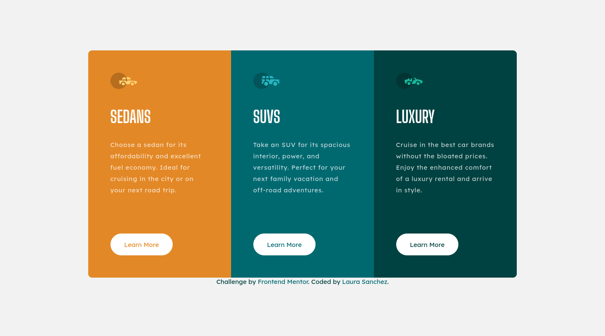

# Frontend Mentor - 3-column preview card component solution

This is a solution to the [3-column preview card component challenge on Frontend Mentor](https://www.frontendmentor.io/challenges/3column-preview-card-component-pH92eAR2-). Frontend Mentor challenges help you improve your coding skills by building realistic projects. 

## Table of contents

- [Frontend Mentor - 3-column preview card component solution](#frontend-mentor---3-column-preview-card-component-solution)
  - [Table of contents](#table-of-contents)
  - [Overview](#overview)
    - [The challenge](#the-challenge)
    - [Screenshot](#screenshot)
    - [Links](#links)
  - [My process](#my-process)
    - [Built with](#built-with)
    - [What I learned](#what-i-learned)
  - [Author](#author)

## Overview

### The challenge

Users should be able to:

- View the optimal layout depending on their device's screen size
- See hover states for interactive elements

### Screenshot

### Links

- Solution URL: [Frontent Mentor](https://www.frontendmentor.io/solutions/responsive-3-column-preview-card-component-with-grid-NqQwv8mTBA)
- Live Site URL: [Github Pages](https://lau-san.github.io/fm-3-column-preview-card/)

## My process

### Built with

- Semantic HTML5 markup
- Flexbox
- CSS Grid
- [Sass](https://sass-lang.com)

### What I learned

- I learned to use `max-width` property to make the website more responsive.
- I got a bit of practice with basic CSS Grid.

## Author

- Frontend Mentor - [@Lau-San](https://www.frontendmentor.io/profile/Lau-San)
